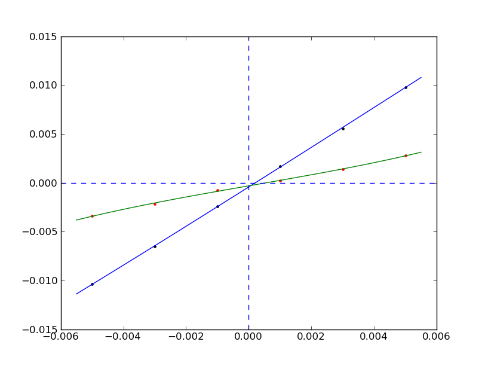

Installation
============

.. image:: https://anaconda.org/jochym/elastic/badges/version.svg
   :target: https://anaconda.org/jochym/elastic
.. image:: https://anaconda.org/jochym/elastic/badges/installer/conda.svg
   :target: https://conda.anaconda.org/jochym

The installation procedure is quite simple if you use, *highly recommended*
`conda package manager <http://conda.pydata.org/miniconda.html>`_

    conda install -c jochym elastic

The above command installs elastic with all dependencies into your current
conda environment. If you want to add my anaconda.org channel into your conda
installation you need to run following command:

    conda config --add channels jochym

The above method has additional benefit of providing current installation of
ASE and spglib libraries.

To install the code *pedestrian way* you need to install following python 
packages (most, if not all, are available in major linux distributions):

* `SciPy and NumPy <http://www.scipy.org/>`_ libraries
* `matplotlib <http://matplotlib.sourceforge.net/>`_ (not strictly required,
  but needed for testing and plotting)
* `ASE <https://wiki.fysik.dtu.dk/ase/>`_ system
* Some ASE calculator (VASP, GPAW, abinit, ...), but be warned that for now 
  the code was developed using VASP only. I will be happy to help you extending
  it to other calculators.
* `spglib <http://spglib.sourceforge.net/>`_ space group library 
* `pyspglib <http://spglib.sourceforge.net/pyspglibForASE/>`_ python space group module

This is highly system-dependent and I am unable to provide detailed support for
this type of install - I use conda install of ASE/elastic myself!

Some legacy `installation guides <https://github.com/jochym/qe-doc/blob/master/Installation.ipynb>`_ 
which may help you with manual process could be find at the 
`QE-doc project pages <https://jochym.github.io/qe-doc/>`_.

Testing
-------

All modules have small testing sets at the end. You can run these test by 
simply running each module as a python script::

    python parcalc.py

which will run a short series of single-point calculations on the MgO unit
cell and plot the resulting equation of state. 

The main module testing routine::

    python elastic.py

will run the equation of state and elastic tensor calculations for a set of 
small crystals - one for each Bravais lattice. This may take some considerable
time. 

The testing routines will probably not work out of the box in your system.
Review the comments at the end of the files to make them work. I will try to make 
them as setup-agnostic as possible.

Usage
=====

In this section we assume that you have all parts of ASE properly installed and 
the elastic is installed and working properly. The examples are available in the 
`example subdirectory <http://bazaar.launchpad.net/~jochym/elastic/trunk/files/head:/example/>`_. 
The code below use also scipy, numpy and matplotlib functions. 
The VASP calculator is used in all examples (at least for now).

IPython notebook with `additional example <http://nbviewer.ipython.org/github/jochym/qe-doc/blob/master/Elastic_constants.ipynb>`_ 
presents calculation using `QE-util package <https://github.com/jochym/qe-util>`_ 

.. _parcalc:

Simple Parallel Calculation
---------------------------

Once you have everything installed and running you can run your first real 
calculation. The testing code at the end of the parcalc.py may be used as 
an example how to do it. The first step is to import the modules to your 
program (the examples here use VASP calculator)::

    from ase.lattice.spacegroup import crystal
    from parcalc import ClusterVasp, ParCalculate
    import ase.units as units
    import numpy
    import matplotlib.pyplot as plt

next we need to create the crystal, MgO in this case::

    a = 4.194
    cryst = crystal(['Mg', 'O'], 
                    [(0, 0, 0), (0.5, 0.5, 0.5)], 
                    spacegroup=225,
                    cellpar=[a, a, a, 90, 90, 90])

We need a calculator for our job, here we use VASP and ClusterVasp defined 
in the parcalc module. You can probably replace this calculator by any other ASE
calculator but this was not tested yet. Thus let us define the calculator::

    # Create the calculator running on one, eight-core node.
    # This is specific to the setup on my cluster.
    # You have to adapt this part to your environment
    calc = ClusterVasp(nodes=1, ppn=8)
    
    # Assign the calculator to the crystal
    cryst.set_calculator(calc)
    
    # Set the calculation parameters
    calc.set(prec = 'Accurate', xc = 'PBE', lreal = False,  
                nsw=30, ediff=1e-8, ibrion=2, kpts=[3,3,3])
    
    # Set the calculation mode first.
    # Full structure optimization in this case.
    # Not all calculators have this type of internal minimizer!
    calc.set(isif=3)

Finally, run our first calculation. Obtain relaxed structure and 
residual pressure after optimization::

    print "Residual pressure: %.3f bar" % (
                cryst.get_isotropic_pressure(cryst.get_stress()))

If this returns proper pressure (close to zero) we can use the obtained 
structure for further calculations. For example we can scan the volume axis to
obtain points for equation of state fitting. This will demonstrate the 
ability to run several calculations in parallel - if you have a cluster of
machines at your disposal this will speed up the calculation considerably::

    # Lets extract optimized lattice constant.
    # MgO is cubic so a is a first diagonal element of lattice matrix
    a=cryst.get_cell()[0,0]

    # Clean up the directory
    calc.clean()

    sys=[]
    # Iterate over lattice constant in the +/-5% range
    for av in numpy.linspace(a*0.95,a*1.05,5):
        sys.append(crystal(['Mg', 'O'], [(0, 0, 0), (0.5, 0.5, 0.5)], 
                    spacegroup=225, cellpar=[av, av, av, 90, 90, 90]))
                       
    # Define the template calculator for this run
    # We can use the calc from above. It is only used as a template.
    # Just change the params to fix the cell volume
    calc.set(isif=2)

    # Run the calculation for all systems in sys in parallel
    # The result will be returned as list of systems res
    res=ParCalculate(sys,calc)
    
    # Collect the results
    v=[]
    p=[]
    for s in res :
        v.append(s.get_volume())
        p.append(s.get_isotropic_pressure(s.get_stress()))

    # Plot the result (you need matplotlib for this
    plt.plot(v,p,'o')
    plt.show()

If you set up everything correctly you should obtain plot similar to this:

.. figure:: fig/plot1.png
   :figwidth: 100%
   :width: 600pt
   :height: 450pt
   :scale: 66%
   :align: center
   
   The pressure dependence on volume in MgO crystal (example1.py).

.. _BMEOS:

Birch-Murnaghan Equation of State
---------------------------------

Let us now use the tools provided by the modules to calculate equation 
of state for the crystal and verify it by plotting the data points against
fitted EOS curve. The EOS used by the module is a well established 
Birch-Murnaghan formula (P - pressure, V - volume, B - parameters):

.. math::
   P(V)= \frac{B_0}{B'_0}\left[
   \left({\frac{V}{V_0}}\right)^{-B'_0} - 1
   \right]

We will start with the same crystal optimized above, 
but this time we will use a new functionality imported from the elastic 
module. This module acts as a plug-in for the Atoms class - extending their
range of quantities accessible for the user::

    import elastic
    from elastic import BMEOS

    a = 4.194
    cryst = crystal(['Mg', 'O'], 
                    [(0, 0, 0), (0.5, 0.5, 0.5)], 
                    spacegroup=225,
                    cellpar=[a, a, a, 90, 90, 90])

Now we repeat the setup and optimization procedure from the example 1 above 
but using a new Crystal class (see above we skip this part for brevity). 
Then comes a new part (IDOF - Internal Degrees of Freedom)::

    # Switch to cell shape+IDOF optimizer
    calc.set(isif=4)

    # Calculate few volumes and fit B-M EOS to the result
    # Use +/-3% volume deformation and 5 data points
    fit=cryst.get_BM_EOS(n=5,lo=0.97,hi=1.03)
    
    # Get the P(V) data points just calculated
    pv=numpy.array(cryst.pv)
    
    # Sort data on the first column (V)
    pv=pv[pv[:,0].argsort()]
    
    # Print just fitted parameters
    print "V0=%.3f A^3 ; B0=%.2f GPa ; B0'=%.3f ; a0=%.5f A" % ( 
            fit[0], fit[1]/units.GPa, fit[2], pow(fit[0],1./3))
            
    v0=fit[0]

    # B-M EOS for plotting
    fitfunc = lambda p, x: [BMEOS(xv,p[0],p[1],p[2]) for xv in x]

    # Ranges - the ordering in pv is not guarateed at all!
    # In fact it may be purely random.
    x=numpy.array([min(pv[:,0]),max(pv[:,0])])
    y=numpy.array([min(pv[:,1]),max(pv[:,1])])

    
    # Plot the P(V) curves and points for the crystal
    # Plot the points
    plt.plot(pv[:,0]/v0,pv[:,1],'o')
    
    # Mark the center P=0 V=V0
    plt.axvline(1,ls='--')
    plt.axhline(0,ls='--')

    # Plot the fitted B-M EOS through the points
    xa=numpy.linspace(x[0],x[-1],20)
    plt.plot(xa/v0,fitfunc(fit,xa),'-')
    plt.draw()

If you set up everything correctly you should obtain fitted parameters printed 
out in the output close to:

.. math::
   V_0 = 73.75 \text{ A}^3 \quad
   B_0 = 170 \text{ GPa}  \quad
   B'_0 = 4.3  \quad
   a_0 = 4.1936 \text{ A}

and the following (or similar) plot:

.. figure:: fig/plot2.png
   :figwidth: 100%
   :width: 600pt
   :height: 450pt
   :scale: 66%
   :align: center
   
   The pressure dependence on volume in MgO crystal (example2.py). 

Calculation of the elastic tensor
---------------------------------

Finally let us calculate an elastic tensor for the same simple cubic crystal -
magnesium oxide (MgO). For this we need to create the crystal and optimize its 
structure (see :ref:`parcalc` above). Once we have an optimized structure we can
switch the calculator to internal degrees of freedom optimization (IDOF) and
calculate the elastic tensor::

    # Switch to IDOF optimizer
    calc.set(isif=2)

    # Elastic tensor by internal routine
    Cij, Bij=cryst.get_elastic_tensor(n=5,d=0.33)
    print "Cij (GPa):", Cij/units.GPa
    

To make sure we are getting the correct answer let us make the calculation 
for :math:`C_{11}, C{12}` by hand. We will deform the cell along a (x) axis
by +/-0.2% and fit the 3:math:`^{rd}` order polynomial to the stress-strain 
data. The linear component of the fit is the element of the elastic tensor::

    # Create 10 deformation points on the a axis
    sys=[]
    for d in linspace(-0.2,0.2,10):
        sys.append(cryst.get_cart_deformed_cell(axis=0,size=d))
    
    # Calculate the systems and collect the stress tensor for each system
    r=ParCalculate(sys,cryst.calc)
    ss=[]
    for s in r:
        ss.append([s.get_strain(cryst), s.get_stress()])

    # Plot strain-stress relation
    ss=[]
    for p in r:
        ss.append([p.get_strain(cryst),p.get_stress()])
    ss=array(ss)
    lo=min(ss[:,0,0])
    hi=max(ss[:,0,0])
    mi=(lo+hi)/2
    wi=(hi-lo)/2
    xa=linspace(mi-1.1*wi,mi+1.1*wi, 50)
    plt.plot(ss[:,0,0],ss[:,1,0],'k.')
    plt.plot(ss[:,0,0],ss[:,1,1],'r.')

    plt.axvline(0,ls='--')
    plt.axhline(0,ls='--')

    # Now fit the polynomials to the data to get elastic constants
    # C11 component
    f=numpy.polyfit(ss[:,0,0],ss[:,1,0],3)
    c11=f[-2]/units.GPa
    
    # Plot the fitted function
    plt.plot(xa,numpy.polyval(f,xa),'b-')

    # C12 component
    f=numpy.polyfit(ss[:,0,0],ss[:,1,1],3)
    c12=f[-2]/units.GPa

    # Plot the fitted function
    plt.plot(xa,numpy.polyval(f,xa),'g-')

    # Here are the results. They should agree with the results
    # of the internal routine.
    print 'C11 = %.3f GPa, C12 = %.3f GPa => K= %.3f GPa' % (
            c11, c12, (c11+2*c12)/3)

    plt.show()

If you set up everything correctly you should obtain fitted parameters printed 
out in the output close to:

    :math:`C_{ij}` (GPa): [ 319.1067       88.8528      139.35852632]

With the following result of fitting:

    :math:`C_{11}` = 317.958 GPa, :math:`C_{12}` = 68.878 GPa => K= 151.905 GPa

and the following (or similar) plot:

   
   The pressure dependence on volume in MgO crystal (example3.py). 

