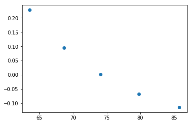
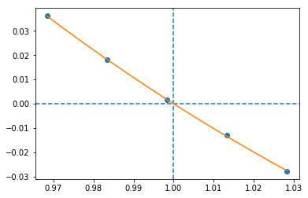
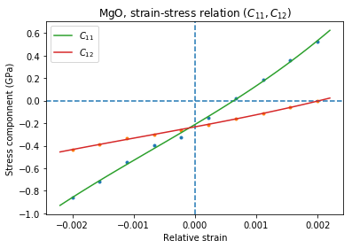

Library usage
=============

Simple Parallel Calculation
---------------------------

Once you have everything installed and running you can run your first
real calculation. The first step is to import the modules to your
program (the examples here use VASP calculator)

.. code:: python

    from ase.spacegroup import crystal
    import ase.units as units
    import numpy
    import matplotlib.pyplot as plt
    
    from parcalc import ClusterVasp, ParCalculate
    
    from elastic import get_pressure, BMEOS, get_strain
    from elastic import get_elementary_deformations, scan_volumes
    from elastic import get_BM_EOS, get_elastic_tensor

next we need to create our example MgO crystal:

.. code:: python

    a = 4.194
    cryst = crystal(['Mg', 'O'], 
                    [(0, 0, 0), (0.5, 0.5, 0.5)], 
                    spacegroup=225,
                    cellpar=[a, a, a, 90, 90, 90])

We need a calculator for our job, here we use VASP and ClusterVasp
defined in the parcalc module. You can probably replace this calculator
by any other ASE calculator but this was not tested yet. Thus let us
define the calculator:

.. code:: python

    # Create the calculator running on one, eight-core node.
    # This is specific to the setup on my cluster.
    # You have to adapt this part to your environment
    calc = ClusterVasp(nodes=1, ppn=8)
    
    # Assign the calculator to the crystal
    cryst.set_calculator(calc)
    
    # Set the calculation parameters
    calc.set(prec = 'Accurate', xc = 'PBE', lreal = False,  
                nsw=30, ediff=1e-8, ibrion=2, kpts=[3,3,3])
    
    # Set the calculation mode first.
    # Full structure optimization in this case.
    # Not all calculators have this type of internal minimizer!
    calc.set(isif=3)

Finally, run our first calculation. Obtain relaxed structure and
residual pressure after optimization:

.. code:: python

    print("Residual pressure: %.3f bar" % (
            get_pressure(cryst.get_stress())))

.. parsed-literal::

    Residual pressure: 0.000 bar

If this returns proper pressure (close to zero) we can use the obtained
structure for further calculations. For example we can scan the volume
axis to obtain points for equation of state fitting. This will
demonstrate the ability to run several calculations in parallel - if you
have a cluster of machines at your disposal this will speed up the
calculation considerably.

.. code:: python

    # Lets extract optimized lattice constant.
    # MgO is cubic so a is a first diagonal element of lattice matrix
    a=cryst.get_cell()[0,0]
    
    # Clean up the directory
    calc.clean()
    
    systems=[]
    # Iterate over lattice constant in the +/-5% range
    for av in numpy.linspace(a*0.95,a*1.05,5):
        systems.append(crystal(['Mg', 'O'], [(0, 0, 0), (0.5, 0.5, 0.5)], 
                        spacegroup=225, cellpar=[av, av, av, 90, 90, 90]))
    
    # Define the template calculator for this run
    # We can use the calc from above. It is only used as a template.
    # Just change the params to fix the cell volume
    calc.set(isif=2)
    
    # Run the calculation for all systems in sys in parallel
    # The result will be returned as list of systems res
    res=ParCalculate(systems,calc)
    
    # Collect the results
    v=[]
    p=[]
    for s in res :
        v.append(s.get_volume())
        p.append(get_pressure(s.get_stress()))
    
    # Plot the result (you need matplotlib for this
    plt.plot(v,p,'o')
    plt.show()

.. parsed-literal::

    Workers started: 5

Birch-Murnaghan Equation of State
---------------------------------

Let us now use the tools provided by the modules to calculate equation
of state for the crystal and verify it by plotting the data points
against fitted EOS curve. The EOS used by the module is a well
established Birch-Murnaghan formula (P - pressure, V - volume, B -
parameters):

.. math::

      P(V)= \frac{B_0}{B'_0}\left[
      \left({\frac{V}{V_0}}\right)^{-B'_0} - 1
      \right]

Now we repeat the setup and optimization procedure from the example 1
above but using a new Crystal class (see above we skip this part for
brevity). Then comes a new part (IDOF - Internal Degrees of Freedom):

.. code:: python

    # Switch to cell shape+IDOF optimizer
    calc.set(isif=4)
    
    # Calculate few volumes and fit B-M EOS to the result
    # Use +/-3% volume deformation and 5 data points
    deform=scan_volumes(cryst, n=5,lo=0.97,hi=1.03)
    
    # Run the calculations - here with Cluster VASP
    res=ParCalculate(deform,calc)
    
    # Post-process the results
    fit=get_BM_EOS(cryst, systems=res)
    
    # Get the P(V) data points just calculated
    pv=numpy.array(cryst.pv)
    
    # Sort data on the first column (V)
    pv=pv[pv[:, 0].argsort()]
    
    # Print just fitted parameters
    print("V0=%.3f A^3 ; B0=%.2f GPa ; B0'=%.3f ; a0=%.5f A" % ( 
            fit[0], fit[1]/units.GPa, fit[2], pow(fit[0],1./3)))
    
    v0=fit[0]
    
    # B-M EOS for plotting
    fitfunc = lambda p, x: numpy.array([BMEOS(xv,p[0],p[1],p[2]) for xv in x])
    
    # Ranges - the ordering in pv is not guarateed at all!
    # In fact it may be purely random.
    x=numpy.array([min(pv[:,0]),max(pv[:,0])])
    y=numpy.array([min(pv[:,1]),max(pv[:,1])])
    
    
    # Plot the P(V) curves and points for the crystal
    # Plot the points
    plt.plot(pv[:,0]/v0,pv[:,1]/units.GPa,'o')
    
    # Mark the center P=0 V=V0
    plt.axvline(1,ls='--')
    plt.axhline(0,ls='--')
    
    # Plot the fitted B-M EOS through the points
    xa=numpy.linspace(x[0],x[-1],20)
    plt.plot(xa/v0,fitfunc(fit,xa)/units.GPa,'-')
    plt.title('MgO pressure vs. volume')
    plt.xlabel('$V/V_0$')
    plt.ylabel('P (GPa)')
    plt.show()

.. parsed-literal::

    Workers started: 5
    V0=74.233 A^3 ; B0=168.19 GPa ; B0'=4.270 ; a0=4.20275 A

If you set up everything correctly you should obtain fitted parameters
printed out in the output close to:

.. math::

      V_0 = 73.75 \text{ A}^3 \quad
      B_0 = 170 \text{ GPa}  \quad
      B'_0 = 4.3  \quad
      a_0 = 4.1936 \text{ A}

Calculation of the elastic tensor
---------------------------------

Finally let us calculate an elastic tensor for the same simple cubic
crystal - magnesium oxide (MgO). For this we need to create the crystal
and optimize its structure (see :ref:``parcalc`` above). Once we have an
optimized structure we can switch the calculator to internal degrees of
freedom optimization (IDOF) and calculate the elastic tensor:

.. code:: python

    # Switch to IDOF optimizer
    calc.set(isif=2)
    
    # Create elementary deformations
    systems = get_elementary_deformations(cryst, n=5, d=0.33)
    
    # Run the stress calculations on deformed cells
    res = ParCalculate(systems, calc)
    
    # Elastic tensor by internal routine
    Cij, Bij = get_elastic_tensor(cryst, systems=res)
    print("Cij (GPa):", Cij/units.GPa)

.. parsed-literal::

    Workers started: 10
    Cij (GPa): [ 338.46921273  103.64272667  152.2150523 ]

To make sure we are getting the correct answer let us make the
calculation for :math:`C_{11}, C_{12}` by hand. We will deform the cell
along a (x) axis by +/-0.2% and fit the :math:`3^{rd}` order polynomial
to the stress-strain data. The linear component of the fit is the
element of the elastic tensor:

.. code:: python

    from elastic.elastic import get_cart_deformed_cell
    
    # Create 10 deformation points on the a axis
    systems = []
    for d in numpy.linspace(-0.2,0.2,10):
        systems.append(get_cart_deformed_cell(cryst, axis=0, size=d))
    
    # Calculate the systems and collect the stress tensor for each system
    r = ParCalculate(systems, cryst.calc)
    ss=[]
    for s in r:
        ss.append([get_strain(s, cryst), s.get_stress()])
    
    ss=numpy.array(ss)
    lo=min(ss[:,0,0])
    hi=max(ss[:,0,0])
    mi=(lo+hi)/2
    wi=(hi-lo)/2
    xa=numpy.linspace(mi-1.1*wi,mi+1.1*wi, 50)

.. parsed-literal::

    Workers started: 10

.. code:: python

    # Make a plot
    plt.plot(ss[:,0,0],ss[:,1,0]/units.GPa,'.')
    plt.plot(ss[:,0,0],ss[:,1,1]/units.GPa,'.')
    
    plt.axvline(0,ls='--')
    plt.axhline(0,ls='--')
    
    # Now fit the polynomials to the data to get elastic constants
    # C11 component
    f=numpy.polyfit(ss[:,0,0],ss[:,1,0],3)
    c11=f[-2]/units.GPa
    
    # Plot the fitted function
    plt.plot(xa,numpy.polyval(f,xa)/units.GPa,'-', label='$C_{11}$')
    
    # C12 component
    f=numpy.polyfit(ss[:,0,0],ss[:,1,1],3)
    c12=f[-2]/units.GPa
    
    # Plot the fitted function
    plt.plot(xa,numpy.polyval(f,xa)/units.GPa,'-', label='$C_{12}$')
    plt.xlabel('Relative strain')
    plt.ylabel('Stress componnent (GPa)')
    plt.title('MgO, strain-stress relation ($C_{11}, C_{12}$)')
    plt.legend(loc='best')
    # Here are the results. They should agree with the results
    # of the internal routine.
    print('C11 = %.3f GPa, C12 = %.3f GPa => K= %.3f GPa' % (
            c11, c12, (c11+2*c12)/3))
    
    plt.show()

.. parsed-literal::

    C11 = 325.005 GPa, C12 = 102.441 GPa => K= 176.629 GPa

If you set up everything correctly you should obtain fitted parameters
printed out in the output close to:

::

    Cij (GPa): [ 340   100   180]

With the following result of fitting:

::

    C11 = 325 GPa, C12 = 100 GPa => K= 180 GPa

The actual numbers depend on the details of the calculations setup but
should be fairly close to the above results.
